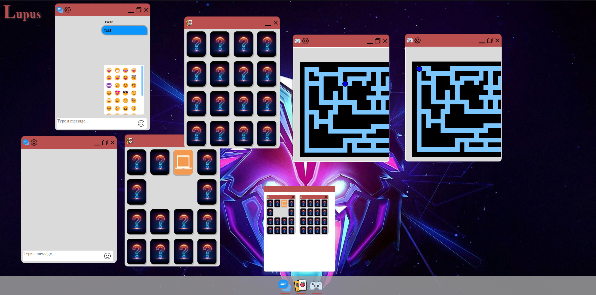

# web-desktop-spa
## Lupus OS



Lupus OS is a **Single Page Application (SPA)** that simulates a desktop environment in the browser.
Users can open multiple applications inside draggable windows, similar to a desktop operating system.

The desktop contains several built-in applications that can be launched from the taskbar.

---

## Applications

### Chat Application

A real-time chat application connected to a WebSocket server used by other students in the course.

Features:

* Real-time messaging
* Multiple chat channels
* Username customization
* Emoji support
* Cached messages using `localStorage`

### Memory Game

A classic memory matching game.

Features:

* Playable with mouse or keyboard
* Multiple game windows can be opened
* Arrow key navigation (left/right implemented)

### Maze Game

A maze game built using the **HTML5 Canvas API**.

Features:

* Player moves using arrow keys
* Win detection
* Replay option
* Multiple game instances can run simultaneously

---

## Extended Features

* Maximize chat application
* Minimize applications
* Hovering over taskbar icons shows currently open applications with **live previews**
* Chat supports **emojis**
* Messages are **cached locally**
* User can **change username**
* User can **select chat channel**

---

## Starting the Application

Clone the repository:

```bash
git clone <repository-url>
```

Navigate to the project folder:

```bash
cd A3-SPA
```

If the `dist` folder does not exist, build the project:

```bash
npm run build
```

Start the development server:

```bash
npm run serve
```

The terminal will display the local server URL.
Open that URL in your web browser to start the application.

---

## Using the Application

Using the application is simple.

Click the **icons in the taskbar** to open applications.

### Memory Game

* Can be played using the **mouse**
* Can also be played with the **arrow keys**
* Only **left and right arrow navigation** was implemented due to time constraints

### Maze Game

* Controlled entirely with **arrow keys**

---

## Technologies Used

* JavaScript
* HTML
* CSS
* Web Components
* Shadow DOM
* WebSockets
* Canvas API
* localStorage
